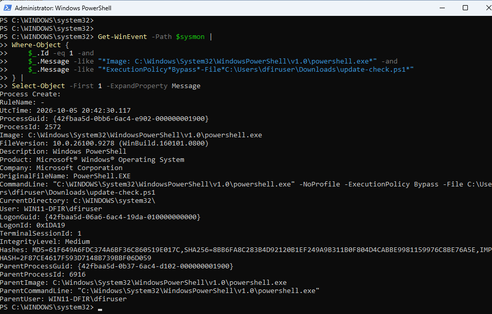
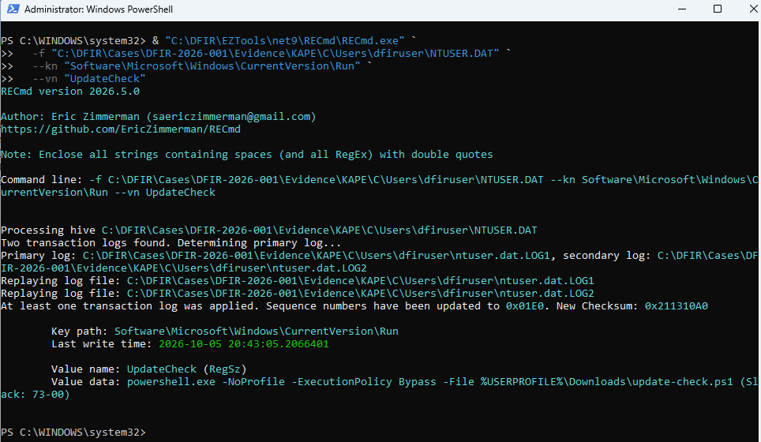
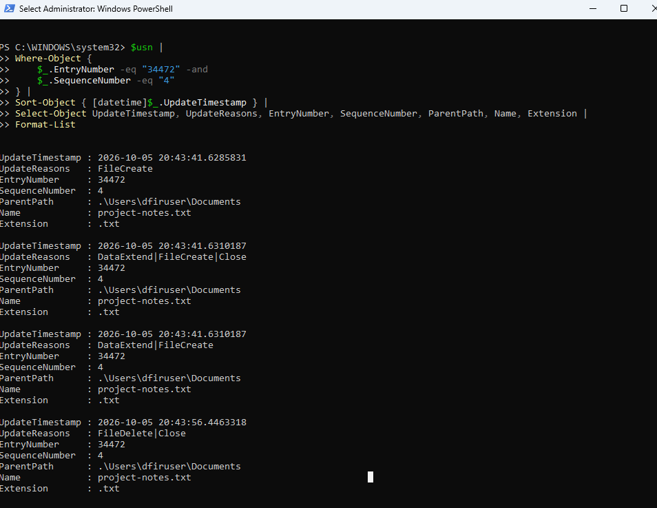
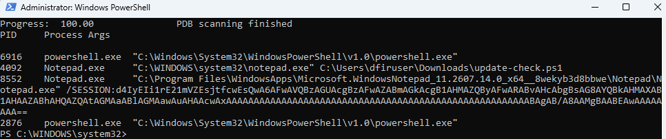
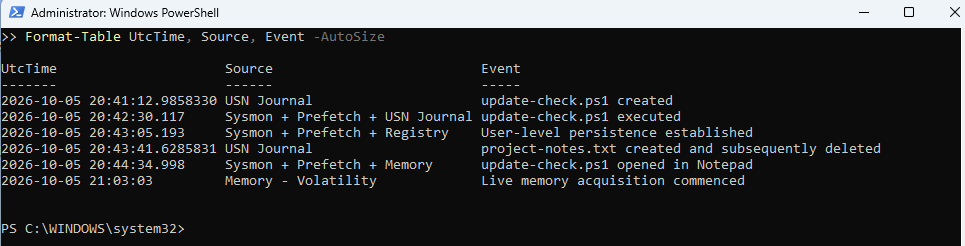

# Windows Digital Forensics Investigation

A hands-on Windows digital forensics investigation focused on reconstructing suspicious PowerShell activity through endpoint artifacts, filesystem evidence, Registry analysis, timeline correlation, and volatile memory.

## Case Overview

**Case ID:** DFIR-2026-001  
**Platform:** Windows 11  
**Investigation Type:** Controlled forensic simulation  
**Primary Focus:** Windows DFIR, artifact correlation, timeline analysis and memory forensics

A Windows workstation was referred for forensic examination following simulated suspicious activity.

The investigation was conducted independently of the original SIEM investigation. Rather than relying on alert telemetry alone, the objective was to determine what could be reconstructed from forensic evidence preserved on the endpoint and in volatile memory.

The investigation sought to establish:

- What executed on the workstation
- Which user and processes were involved
- What files were created or deleted
- Whether persistence was established
- What network-related activity could be reconstructed
- What evidence remained available in volatile memory
- Whether significant events could be corroborated across independent forensic artifacts

## Investigation Workflow

The investigation followed a structured forensic workflow:

1. Preserve the post-incident VM state
2. Acquire volatile memory
3. Collect endpoint forensic artifacts
4. Record evidence hashes
5. Parse individual Windows artifacts
6. Normalize timestamps
7. Construct a consolidated forensic timeline
8. Correlate findings across independent evidence sources
9. Document negative findings and forensic limitations
10. Produce a final case assessment

## Tools Used

- KAPE
- Eric Zimmerman Tools
  - PECmd
  - RECmd
  - MFTECmd
- Volatility 3
- Autopsy
- WinPmem
- Sysmon
- PowerShell
- VMware Workstation

## Evidence Sources

Evidence examined during the investigation included:

- Volatile memory
- Sysmon event logs
- Windows PowerShell artifacts
- Windows Prefetch
- NTUSER.DAT
- NTFS Master File Table
- NTFS USN Journal
- NTFS transaction log artifacts
- PowerShell ConsoleHost history
- Windows shortcut artifacts
- KAPE logical artifact collection

## Key Findings

Six principal findings were established with high confidence:

| ID | Finding | Assessment | Confidence |
|---|---|---|---|
| [F-001](findings/F-001-script-acquisition.md) | PowerShell script acquisition | Confirmed | High |
| [F-002](findings/F-002-script-execution.md) | PowerShell script execution | Confirmed | High |
| [F-003](findings/F-003-registry-persistence.md) | User-level Registry persistence | Confirmed | High |
| [F-004](findings/F-004-deleted-file.md) | Temporary file creation and deletion | Confirmed | High |
| [F-005](findings/F-005-notepad-interaction.md) | PowerShell script opened in Notepad | Confirmed | High |
| [F-006](findings/F-006-network-transfer.md) | Controlled network transfer | Confirmed | High |

The investigation reconstructed a sequence in which a PowerShell script was transferred to the workstation, executed, associated with a Registry Run-key persistence mechanism, and later opened in Notepad. A temporary file was also created and deleted during the incident window.

These conclusions were reached through correlation of multiple forensic artifacts rather than reliance on a single telemetry source.

## Evidence Highlights

The investigation correlated evidence across endpoint telemetry, filesystem metadata, Registry artifacts and volatile memory. The examples below show several of the principal artifacts used to reconstruct the activity.

### PowerShell Script Execution

Sysmon recorded `powershell.exe` executing the downloaded `update-check.ps1` script with `ExecutionPolicy Bypass`.



### Registry Persistence

Independent examination of the acquired user Registry hive confirmed the `UpdateCheck` Run-key value associated with the downloaded PowerShell script.



### Deleted File Activity

USN Journal analysis preserved the lifecycle of `project-notes.md`, including its creation, data write and subsequent deletion, despite the filename no longer being available through the parsed MFT.



### Volatile Memory Corroboration

Volatility recovered the Notepad process with `update-check.ps1` supplied on its command line, independently corroborating activity identified through disk-based artifacts.



### Consolidated Forensic Timeline

Significant events from independent forensic sources were normalized and correlated into a consolidated UTC timeline.



The complete curated screenshot set and timeline exports are available in the [`evidence`](evidence/) directory.

## Repository Structure

```text
docs/
    DFIR-2026-001-Report.md

evidence/
    screenshots/
    timeline/

findings/
    F-001-script-acquisition.md
    F-002-script-execution.md
    F-003-registry-persistence.md
    F-004-deleted-file.md
    F-005-notepad-interaction.md
    F-006-network-transfer.md
```

The repository contains curated investigation outputs only. Raw memory, complete filesystem metadata, Registry hives and other acquired forensic evidence are intentionally excluded.

## Investigation Report

The complete case report is available here:

[DFIR-2026-001 Forensic Report](docs/DFIR-2026-001-Report.md)

## Lab Context

This project was performed in an isolated home DFIR laboratory using controlled benign activity. No malware was deployed.

The purpose of the project is to demonstrate practical Windows forensic investigation methodology, evidence handling, artifact analysis, timeline reconstruction, cross-artifact correlation, and defensible interpretation of both positive and negative findings.


